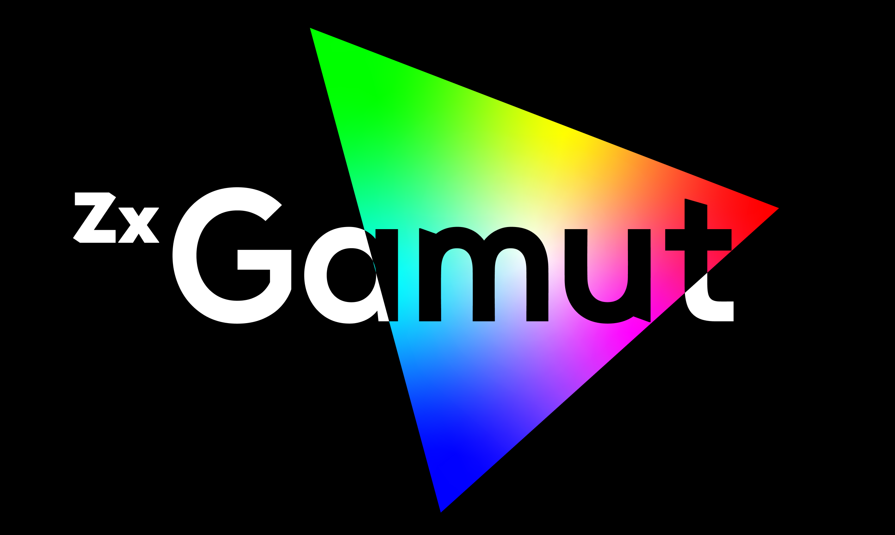
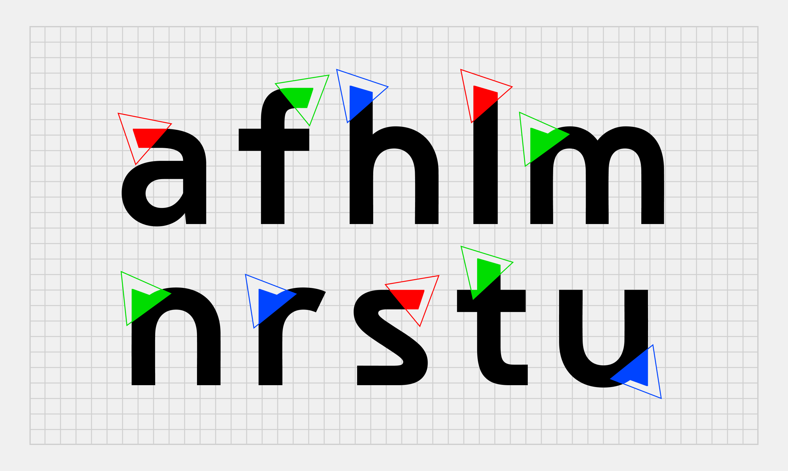
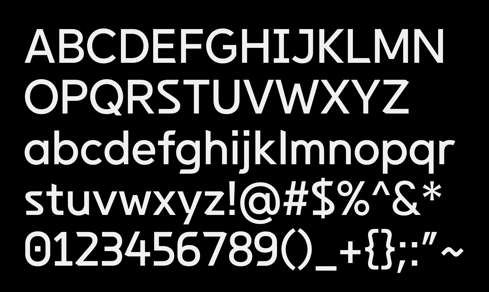
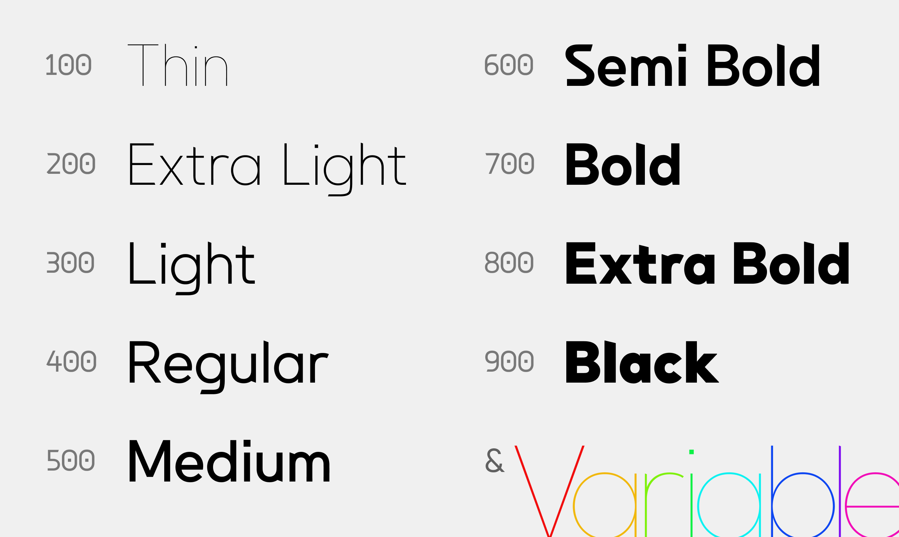
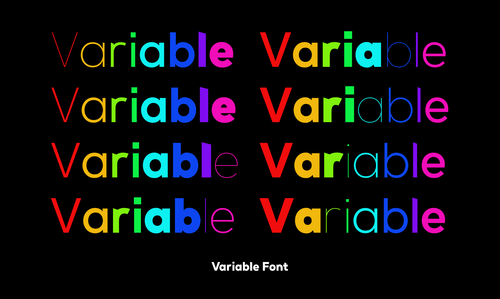
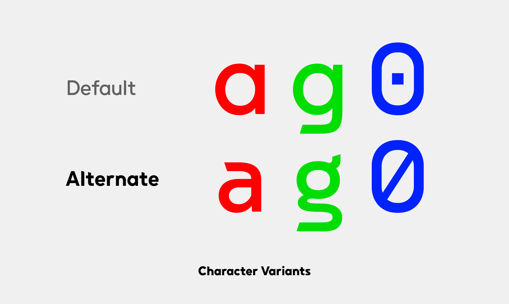
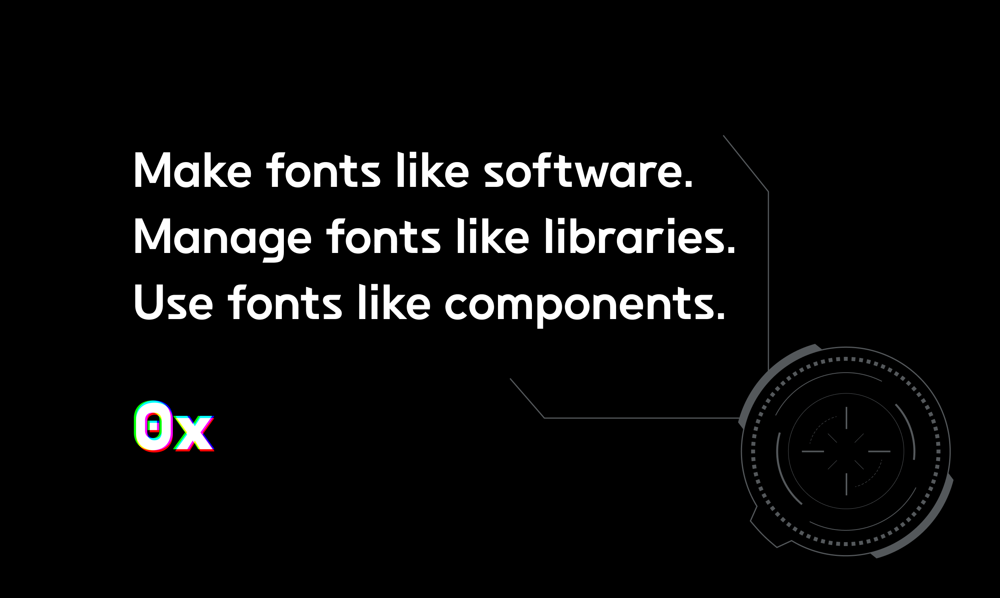

# Zx Gamut

​Zx Gamut is a modern variable sans-serif typeface designed with the precision of software engineering. It strikes a unique visual balance by harmonizing fluid, rounded forms with sharp, calculated edges, creating a dynamic rhythm across any digital canvas.

## Quick Q&A

**Q. Can I legally use Zx Gamut for my purpose?**

A. Most likely YES. Zx Gamut is free and open source. For details, [read the LICENSE](./LICENSE).

**Q. Where can I get Zx Gamut?**

A. [Here](https://github.com/0xType/Gamut/releases)

## License

The SIL Open Font License, Version 1.1

Copyright (c) 2026 [0xType](https://0xtype.dev)
